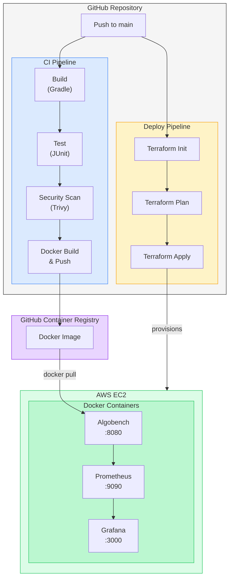

# AlgoBench DevOps Pipeline

This repository demonstrates a demonstrative DevOps Pipeline incorporating modern tooling and practices - it incorporates a performance benchmarking application for comparing various sorting algorithms across different input sizes and data distributions. 

## Architecture



## Technologies

### Application Stack
- **Language:** Java 21 (Eclipse Temurin)
- **Framework:** Spring Boot 3.5.8
- **Build Tool:** Gradle 8.12.1
- **Testing:** JUnit 5.12.2

### DevOps Tools
- **Version Control:** Git 2.43.0
- **CI/CD:** GitHub Actions
- **Containerization:** 
  - Docker 28.5.1
  - Docker Compose v2.40.2
- **Container Registry:** GitHub Container Registry (GHCR)
- **Security Scanning:** Trivy Action 0.33.1 (SARIF format)

### Infrastructure
- **Cloud Platform:** AWS
  - EC2: t3.micro (Amazon Linux 2023)
  - Region: us-east-1
- **IaC:** Terraform 1.0.0+ (AWS Provider 6.23.0)
- **AWS CLI:** 2.31.18

### Monitoring
- **Metrics:** Prometheus (latest fetched)
- **Visualization:** Grafana (latest fetched)


## Project Structure

The project follows following structure:

```
AlgoBench/
|   .dockerignore
|   .gitattributes
|   .gitignore
|   build.gradle.kts
|   docker-compose.yml
|   Dockerfile
|   gradle.properties
|   gradlew
|   gradlew.bat
|   LICENSE
|   README.md
|   settings.gradle
|
+---.devcontainer
|       devcontainer.json
|
+---.github
|   \---workflows
|           ci.yml
|           deploy.yml
|
+---gradle
|   |   libs.versions.toml
|   |
|   \---wrapper
|           gradle-wrapper.jar
|           gradle-wrapper.properties
|
+---monitoring
|       docker-compose.yml
|       prometheus.yml
|
+---src
|   +---main
|   |   +---java
|   |   |   \---ie
|   |   |       \---ronanodea
|   |   |           \---algobench
|   |   |               |   BenchmarkConfig.java
|   |   |               |   Benchmarker.java
|   |   |               |   BenchmarkResultsPrinter.java
|   |   |               |   BenchmarkRunner.java
|   |   |               |   BubbleSort.java
|   |   |               |   BucketSort.java
|   |   |               |   CommandLineParser.java
|   |   |               |   CSVExporter.java
|   |   |               |   InsertionSort.java
|   |   |               |   Main.java
|   |   |               |   MergeSort.java
|   |   |               |   SelectionSort.java
|   |   |               |
|   |   |               \---controller
|   |   |                       BenchmarkController.java
|   |   |
|   |   \---resources
|   |       |   application.properties
|   |       |
|   |       \---static
|   |               index.html
|   |
|   \---test
|       \---java
|           \---ie
|               \---ronanodea
|                   \---algobench
|                           BubbleSortTest.java
|                           BucketSortTest.java
|                           CommandLineParserTest.java
|                           InsertationSortTest.java
|                           MergeSortTest.java
|                           SelectionSortTest.java
|
\---terraform
        .gitignore
        ec2.tf
        main.tf
        outputs.tf
        security-group.tf
        user-data.sh
        variables.tf
```
_______________________________________

## Pipeline Phase 1: Version Control & Dev Container

**Implementation:**

- Cloned my original Algobench repo: 

https://github.com/RonanChrisODea/Algorithm-Benchmarking-Project to Pipeline repository

- Created GitHub repository with proper `.gitignore` for Java/Gradle projects

- Implemented feature branch workflow - will introduce V1.0 tag once application fully functional - tag system for subsequent updates.

- A devcontainer was designed for portability - main dev env run in container; using Linux VM as further isolated development environment. 

```json
{
  "name": "DevOps Pipeline - Java 21 Temurin",
  "image": "eclipse-temurin:21-jdk",
  
  "features": {
    "ghcr.io/devcontainers/features/docker-in-docker:2": {},
    "ghcr.io/devcontainers/features/git:1": {},
    "ghcr.io/devcontainers/features/github-cli:1": {}
  },
  
  "customizations": {
    "vscode": {
      "extensions": [
        "vscjava.vscode-java-pack",
        "vscjava.vscode-gradle",
        "ms-azuretools.vscode-docker",
        "github.vscode-github-actions"
      ]
    }
  },
  
  "postCreateCommand": "chmod +x gradlew && ./gradlew build",
  
  "remoteUser": "root"
}
```

### Landing page: 


## Pipeline Phase 2: Application Finalisation

https://github.com/RODea-L00203120/DevOps_SWE_Pipeline/tree/feature/rest-api

Added a Spring Boot REST API, providing:

- Web-based landing page

- REST endpoints for algorithm operations

- Actuator endpoints for health checks and metrics

- Prometheus metrics endpoint for monitoring           integration added retrospectively

## Pipeline Phase 3: Automated Builds & Testing

- Gradle build system - was incorporated with original repo but automation was implemented though GitHub Actions:

https://github.com/RODea-L00203120/DevOps_SWE_Pipeline/blob/main/.github/workflows/ci.yml

- JUnit 5 test framework Unit Tests for alogrithms included - test reports included as build artifact

https://github.com/RODea-L00203120/DevOps_SWE_Pipeline/tree/main/src/test/java/ie/ronanodea/algobench

### Pipeline Phase 4: Static Analysis and Security Scanning

- Container vunerability scanning implemented via Trivy GitHub Actions module: 

https://github.com/aquasecurity/trivy-action

- Build will not push container to Registry if High/Critical vunerabilities detected

```yaml
    - name: Build Docker image for scanning
      run: docker build -t ${{ steps.image.outputs.name }} .

    - name: Run Trivy vulnerability scanner (SARIF)
      id: trivy-sarif
      uses: aquasecurity/trivy-action@0.28.0
      continue-on-error: true
      with:
        image-ref: '${{ steps.image.outputs.name }}'
        format: 'sarif'
        output: '${{ github.workspace }}/trivy-results.sarif'
        severity: 'CRITICAL,HIGH'
        ignore-unfixed: true

    - name: Upload SARIF as artifact
      uses: actions/upload-artifact@v4
      if: always()
      with:
        name: trivy-sarif-report
        path: '${{ github.workspace }}/trivy-results.sarif'

    - name: Upload Trivy results to GitHub Security tab
      uses: github/codeql-action/upload-sarif@v4
      if: always()
      with:
        sarif_file: '${{ github.workspace }}/trivy-results.sarif'
        category: 'trivy-container-scan'

    - name: Run Trivy vulnerability scanner (Table - Quality Gate)
      id: trivy-table
      uses: aquasecurity/trivy-action@0.28.0
      continue-on-error: true
      with:
        image-ref: '${{ steps.image.outputs.name }}'
        format: 'table'
        severity: 'CRITICAL,HIGH'
        ignore-unfixed: true
        exit-code: '1'

    - name: Check vulnerability scan results
      if: steps.trivy-table.outcome == 'failure'
      run: |
        echo "CRITICAL or HIGH vulnerabilities found!"
        echo "Check the scan output above for details."
        exit 1
```

- Initially found vunerabilities related to Apache Tomcat - solved via updating SpringBoot Version - so it worked as intended.


## Phase 5: Application Containerisation for Deployment

**CI Pipeline Jobs orchestrated:** 

https://github.com/RODea-L00203120/DevOps_SWE_Pipeline/blob/main/.github/workflows/ci.yml

1. **build-and-test** - Compiles application and produces JAR file
2. **security-scan** - Builds Docker image, scans with Trivy
3. **docker-build-push** - Builds and pushes Docker image to GHCR

### Build Details Example via GitHub Actions.

Note the container wasn't pushed to registry as it didn't occur on main branch. 


## Phase 6: Deployment to Cloud (AWS EC2) managed via Terraform

- Seperate deploy workflow for GitHub Actions which pulls latest container from GitHub Container Registry

https://github.com/RODea-L00203120/DevOps_SWE_Pipeline/blob/main/.github/workflows/deploy.yml

```yaml
name: Deploy

on:
  workflow_dispatch:
    inputs:
      action:
        description: 'Terraform action to perform'
        type: choice
        options: [plan, apply, destroy]
        required: true
        default: apply

env:
  AWS_REGION: us-east-1

jobs:
  deploy:
    runs-on: ubuntu-latest
    defaults:
      run:
        working-directory: terraform

    steps:
      - uses: actions/checkout@v4

      - uses: hashicorp/setup-terraform@v3

      - uses: aws-actions/configure-aws-credentials@v4
        with:
          aws-access-key-id: ${{ secrets.AWS_ACCESS_KEY_ID }}
          aws-secret-access-key: ${{ secrets.AWS_SECRET_ACCESS_KEY }}
          aws-region: ${{ env.AWS_REGION }}

      - name: Terraform Init
        run: terraform init

      - name: Terraform Plan
        run: terraform plan -var="docker_image=ghcr.io/rodea-l00203120/devops_swe_pipeline:latest" -out=tfplan

      - name: Terraform Apply
        if: github.event.inputs.action == 'apply'
        run: terraform apply -auto-approve tfplan

      - name: Terraform Destroy
        if: github.event.inputs.action == 'destroy'
        run: terraform destroy -var="docker_image=ghcr.io/rodea-l00203120/devops_swe_pipeline:latest" -auto-approve

      - name: Output Infrastructure Details
        if: github.event.inputs.action == 'apply'
        run: |
          echo "## Deployment Complete!" >> $GITHUB_STEP_SUMMARY
          echo "" >> $GITHUB_STEP_SUMMARY
          terraform output -json | jq -r 'to_entries[] | "- **\(.key)**: \(.value.value)"' >> $GITHUB_STEP_SUMMARY
```

Secrets configured using GitHub GUI


- AWS EC2 (t3.micro) with Elastic IP


- Terraform Infrastructure as Code used to manage resources 

https://github.com/RODea-L00203120/DevOps_SWE_Pipeline/tree/main/terraform


- Manual layer here - human oversight for IaC changes via GitHub actions workflow GUI


## Phase 7: Monitoring and Logging

- Spring Boot Actuator - exposes application metrics 

(`src/main/resources/application.properties`)

```ini
management.endpoints.web.exposure.include=health,prometheus,metrics
management.metrics.export.prometheus.enabled=true
management.endpoint.health.show-details=always
server.port=8080
```


- Prometheus - metrics collection and storage open on port:9090
- Grafana - dashboards and visualisation open on port:3000
- Default Grafana password can be changed after initial login 
- Prometheus can be selected as data source via Graphana Interface
- Dashboard template `4701` JVM micrometer chosen as suitable metric analysis


Monitoring software is deployed automatically via the EC2 bootstrap script (`terraform/user-data.sh`) using Docker Compose.

``` bash
#!/bin/bash
set -e

DOCKER_IMAGE="${docker_image}"
APP_PORT="${app_port}"

# Update system and install Docker
dnf update -y
dnf install -y docker
systemctl start docker
systemctl enable docker

# Wait for Docker to be ready
sleep 10

# Pull and start the application container
docker pull "$DOCKER_IMAGE"
docker stop algobench 2>/dev/null || true
docker rm algobench 2>/dev/null || true
docker run -d \
  --name algobench \
  --restart unless-stopped \
  -p "$APP_PORT:8080" \
  "$DOCKER_IMAGE"

# Install Docker Compose
echo "Installing Docker Compose..."
curl -L "https://github.com/docker/compose/releases/download/v2.24.5/docker-compose-$(uname -s)-$(uname -m)" -o /usr/local/bin/docker-compose
chmod +x /usr/local/bin/docker-compose

# Setup monitoring stack
echo "Setting up monitoring..."
mkdir -p /home/ec2-user/monitoring
cd /home/ec2-user/monitoring

cat > docker-compose.yml <<'EOF'
version: '3.8'

services:
  prometheus:
    image: prom/prometheus:latest
    container_name: prometheus
    ports:
      - "9090:9090"
    volumes:
      - ./prometheus.yml:/etc/prometheus/prometheus.yml
      - prometheus-data:/prometheus
    command:
      - '--config.file=/etc/prometheus/prometheus.yml'
    restart: unless-stopped

  grafana:
    image: grafana/grafana:latest
    container_name: grafana
    ports:
      - "3000:3000"
    environment:
      - GF_SECURITY_ADMIN_PASSWORD=admin
    volumes:
      - grafana-data:/var/lib/grafana
    restart: unless-stopped

volumes:
  prometheus-data:
  grafana-data:
EOF

cat > prometheus.yml <<'EOF'
global:
  scrape_interval: 15s
  evaluation_interval: 15s

scrape_configs:
  - job_name: 'algobench'
    metrics_path: '/actuator/prometheus'
    static_configs:
      - targets: ['172.17.0.1:8080']
EOF

# Start monitoring stack
/usr/local/bin/docker-compose up -d

echo "Monitoring setup complete!"
```

### Demonstration of gathered metric visualisation: 


_________________________

## A note on variable and secret handling:

## Variable and Secret Management

Sensitive credentials are managed securely and never committed to the repository.

**GitHub Actions Secrets:**

| Secret | Purpose |
|--------|---------|
| `AWS_ACCESS_KEY_ID` | AWS authentication |
| `AWS_SECRET_ACCESS_KEY` | AWS authentication |
| `GITHUB_TOKEN` | Auto-provided, used for GHCR push |

**Terraform Variables (`terraform/variables.tf`):**

| Variable | Description | Default |
|----------|-------------|---------|
| `aws_region` | AWS deployment region | us-east-1 |
| `instance_type` | EC2 instance size | t3.micro |
| `app_port` | Application port | 8080 |
| `docker_image` | Container image to deploy | ghcr.io/rodea-l00203120/devops_swe_pipeline:latest |

**Variable Injection:**
- GitHub Actions injects secrets at runtime via `${{ secrets.SECRET_NAME }}`
- Terraform variables passed via `-var` flag in deploy workflow
- EC2 user-data variables injected via Terraform templatefile():

``` HCL
  user_data = templatefile("${path.module}/user-data.sh", {
    docker_image = var.docker_image
    app_port     = var.app_port
  })

```

**Security Notes:**
- No secrets stored in code
- `.gitignore` excludes Terraform state files (contain sensitive data)
- GHCR authentication uses GitHub's built-in `GITHUB_TOKEN`

## To Do:

- Add version tagging from her on - this is version 1.0 - functional and testing but improvements can be made

- Improve VPC and Security Group - Currently open; reduce CIDR block access routes

- Split deploy workflow into seperate plan, apply, destroy workflows for isolation and clarity

- Trivy reports upload but don't display scanned files/vulnerabilities in GitHub Security tab (currently only viewable as artifacts) - fix

- Add more precise benchmark timing and cpu utilisation metrics

- Alter generic landing page template to be more aesthetically pleasing

- Register a domain and point to EC2 instance if economical to maintain for portfolio purposes

